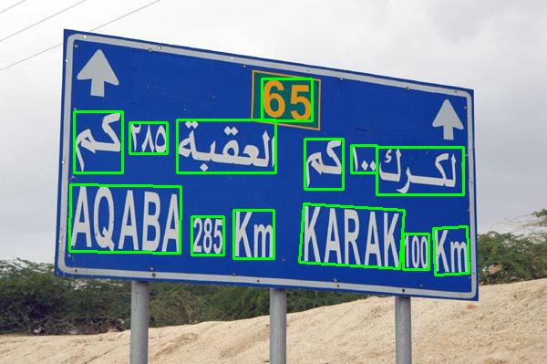

# Mask R-CNN for Text Detection
### Introduction
* A text detector based on Mask R-CNN is used, and the methods are mainly inspired by fully convolutional networks. First, CNN is adopted to detect text blocks, from which character candidates are extracted. Then FPN is used to predict the corresponding segmentation masks. Last, segmentation mask is used to find suitable rectangular bounding boxes for the text instances. 

* This is an implementation of [Mask R-CNN](https://arxiv.org/abs/1703.06870) on Python 3, Keras, and TensorFlow. The model generates bounding boxes and segmentation masks for each instance of an object in the image. It's based on Feature Pyramid Network (FPN) and a ResNet101 backbone.



### Contents
1. [Installation](#installation)
2. [Download](#download)
2. [Demo](#demo)
3. [Test](#train)
4. [Train](#test)
5. [Examples](#examples)
6. [Result](#result)
### Installation
* Python 3.6
* Tensorflow v1.8.0+
* Keras
* opencv-python 3.4+

### Download
Models trained on ICDAR 2017 (training set) + ICDAR 2019 (training set): [Download link](https://rrc.cvc.uab.es/)

### Test
If you've downloaded the pre-trained model, you can run

```
python test.py 
```

a text file will be then written to the output path.


### Train

### Result
##### Mask R-CNN for ICDAR MLT 2017 Challenge 1 Text detection.
|             Method | Precision (%) | Recall (%) | F-measure (%)             | 
| - | - | - | - |
| Mask R-CNN-resnet101 |      83.52       |      76.58      |      79.89      |
